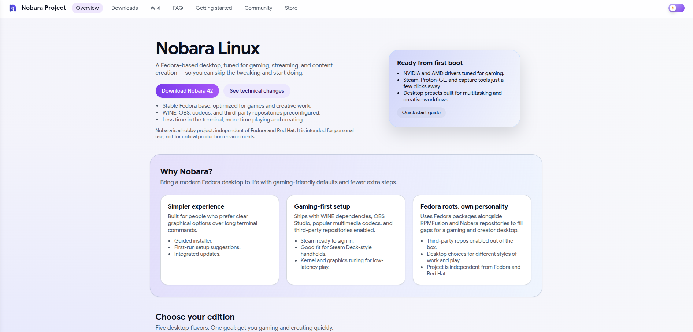
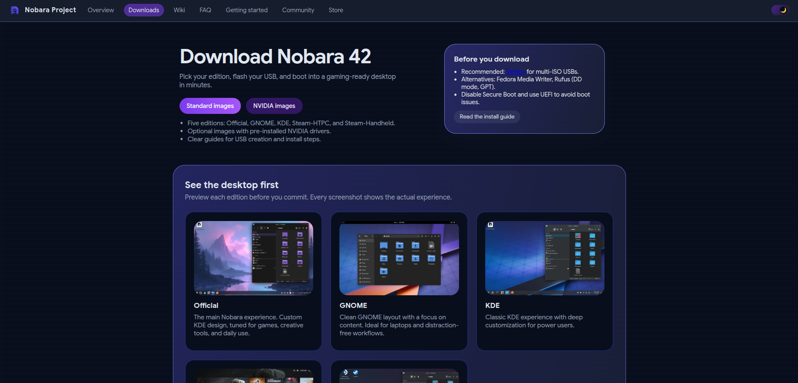
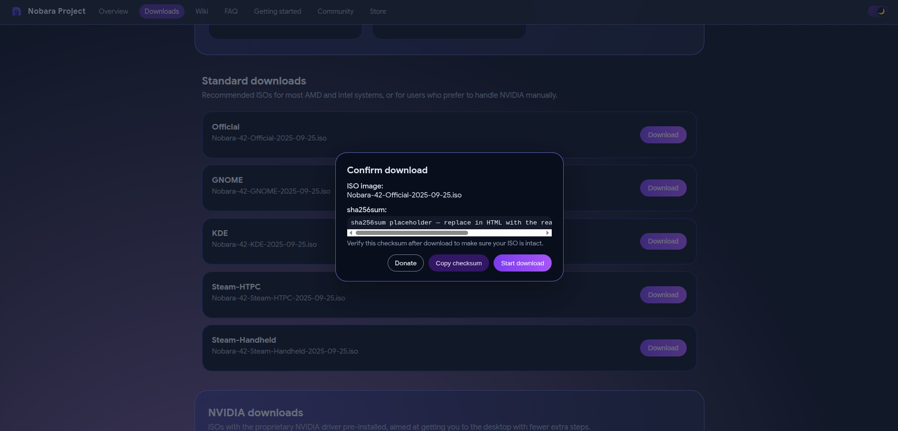

# Nobara Website (Material 3 Inspired Redesign)



A modern, responsive redesign of the Nobara Project website, inspired by the visual language of Google Store and Google Antigravity.  
This version focuses on clarity, smooth interactions, and an elegant Material 3 aesthetic.

> 💡 Tip: Place your own screenshots in the `img/` folder with the filenames used below  
> (or update the paths to match your actual screenshot names).

---

## ✨ Features

- Material You / Material 3–inspired interface  
- Light & dark themes with animated sun/moon toggle  
- Subtle reactive background gradient that follows pointer movement  
- Zoomable images (lightbox) for edition previews  
- Download dialog including:  
  - ISO filename  
  - SHA256 checksum  
  - Copy checksum button  
  - Donate link  
  - Confirm download button  
- Fully responsive design across desktop and mobile  
- Built using pure HTML, CSS, and JS (no frameworks)

---

## 🖼 Screenshots

### Light mode


### Dark mode



### Download dialog with checksum



You can generate or capture these screenshots yourself and save them with the same filenames inside the `img/` directory:

- `img/nobara-hero-light.png`
- `img/nobara-hero-dark.png`
- `img/nobara-download-dialog.png`

Or update the image paths in this README to match your own filenames.

---

## 📁 Project Structure

```text
index.html               → Homepage  
download.html            → Downloads page  
styles.css               → Design system, animations, theming  
script.js                → Theme toggle, menu drawer, dialogs, interactions  

img/
  nobara-icon.png        → Logo / favicon
  nobara-hero-light.png  → (your screenshot) light mode preview
  nobara-hero-dark.png   → (your screenshot) dark mode preview
  nobara-download-dialog.png → (your screenshot) download dialog preview
```

---

## 🚀 Running Locally

You can open `index.html` directly, or serve the folder with a simple static server:

```bash
python3 -m http.server
```

Then visit:

```text
http://localhost:8000
```

---

## 📜 About

This is an independent redesign project inspired by Nobara.  
It is **not officially affiliated** with the Nobara Project, Fedora, or Red Hat.
